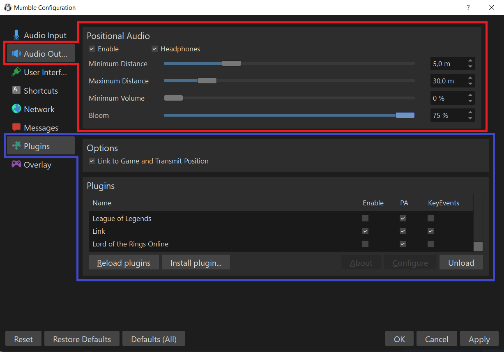

# MumbleLinkExs

.. is a *[Vintage Story]* mod which enables *[Mumble]* positional audio through its Link plugin.

When connected to a multiplayer server that has this mod installed, players who are in the same voice chat channel are able to hear one another spatially in 3D, relative to their avatars' positions in-game.

This mod requires separate voice chat program [Mumble], and a Mumble server to connect to. Headphones highly recommended.

[Vintage Story]: https://vintagestory.at/
[Mumble]: https://www.mumble.info/

## Download / Installation

If you are player, this mod should automatically be downloaded when you join the server.

If you are server host, you can download latest version on the mod from the [Mod Page](https://mods.vintagestory.at/mumblelinkexs).

To install, put the `.zip` file you downloaded into the mods folder **without extracting it**.

## Configuration

To enable positional audio in Mumble:

1. Check the *Enabled* checkbox in Audio Output > Positional Audio.
2. Change the positional audio parameters as on the image below.
3. Ensure that you're using a stereo audio output device. Headphones recommended.
4. Check the *Link to Game and Transmit Position* checkbox in Plugins > Options.
5. Enable *Link* plugin in Plugins > Plugins.

These settings will only affect how **you** hear others. For best effect, make sure that everyone is using the same values.

### Flatpak

If you are a Linux user that installed Vintage Story as a Flatpak, you will need to give Vintage Story access to shared memory for the connection with Mumble to work. To do that:
- Install [Flatseal](https://flathub.org/apps/details/com.github.tchx84.Flatseal). This allows you to change the settings of Flatpak Apps.
- Once installed, open Flatseal and click on Vintage Story.
- Scroll down to the option "Shared Memory" (under "Device"), and enable it.
- Restart the game if it is open.

## Credits

This mod was originally created by [copygirl](https://github.com/copygirl), adapted to 1.18.x by [SolraBizna](https://github.com/SolraBizna) and further enhanced by [Dmitry221060](https://github.com/Dmitry221060).
